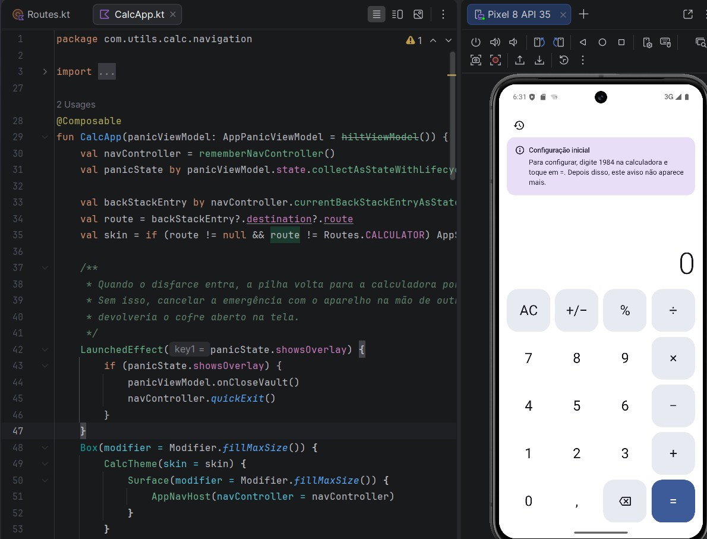
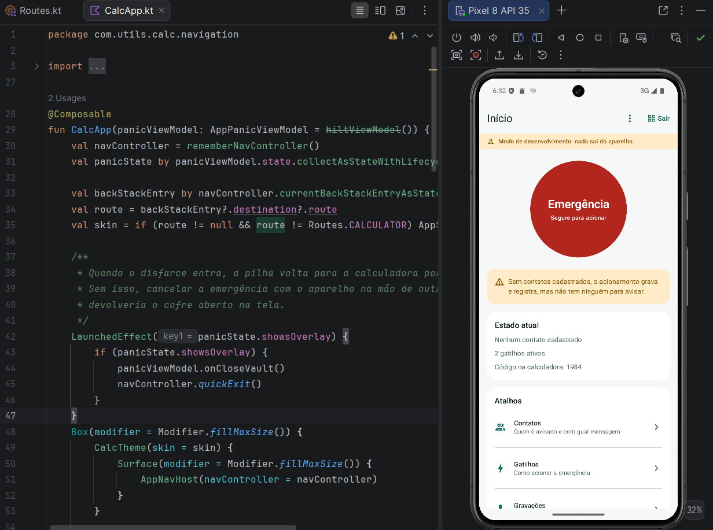

# Ghosty

**Um app de segurança pessoal que ninguém reconhece, porque por fora ele é só uma calculadora.**

No aparelho, o app se chama "Calculadora" e tem ícone de calculadora. Ghosty é o nome do projeto, não o que aparece na tela inicial de quem usa.

## O problema

Perigo de verdade quase nunca vem com aviso, e quase nunca sobra tempo para procurar um app, destravar a tela e explicar a situação para alguém.

Sequestro relâmpago. Assalto. Uma carona que tomou o rumo errado. Uma abordagem na rua. Uma ameaça dentro de casa. Um encontro com alguém que você acabou de conhecer. São situações muito diferentes, mas todas têm as mesmas duas restrições: você tem segundos, e não pode deixar claro que está pedindo ajuda.

É aí que quase todo app de emergência falha. Um ícone de escudo vermelho na tela inicial é a primeira coisa que alguém vê ao pegar seu celular, e o simples fato de ele existir já entrega a intenção. Botão de pânico que precisa ser encontrado não serve para quem está sendo observado.

A proteção só funciona se for invisível.

## A ideia

Você abre o app e vê uma calculadora. Não uma tela que parece uma calculadora: uma calculadora de verdade, que soma, divide, calcula porcentagem e guarda histórico. Dá para usar no supermercado. Dá para emprestar para alguém.

Só que existe uma conta que ela não faz. Quando um código específico é digitado e a tecla `=` é pressionada, acontece uma de duas coisas:

- **Abre o cofre**, com contatos de confiança, gatilhos, gravações e ajustes.
- **Dispara a emergência em silêncio**, sem nada piscar ou vibrar. A tela continua sendo uma calculadora enquanto o aparelho registra a localização, grava e prepara o aviso.

Para quem estiver olhando por cima do ombro, foi só mais uma conta.

## O código de coação

Cedo ou tarde alguém pode obrigar você a abrir o app: um assaltante conferindo o celular, alguém desconfiado, qualquer pessoa com poder sobre você naquele momento. Por isso existe um segundo código.

Ele também abre um cofre, mas um cofre falso: mesma aparência, mesmo menu, contatos genéricos, nenhuma gravação, um código de pânico que não é o verdadeiro. Um cofre plausível, de quem configurou faz pouco e ainda não usou. Quem está olhando vê o app inteiro, se convence e vai embora. Se você quiser, esse mesmo código dispara o alerta silencioso no mesmo instante.

Um cofre vazio demais entrega o jogo tanto quanto um cofre cheio.

## O que tem dentro

**Vários jeitos de acionar.** O código na calculadora é o principal. Segurar a tecla `0` por 3 segundos é o atalho de quem não tem tempo de digitar. Dentro do cofre há o botão de emergência, que só responde se for mantido pressionado, para não disparar no bolso.

**Contagem regressiva para desistir.** Acionou sem querer? Um toque longo cancela, dentro do prazo que você mesmo configurou.

**Disfarce durante a emergência.** A tela pode continuar sendo uma calculadora normal, ficar preta como se o aparelho tivesse desligado, ou mostrar um aviso de bateria fraca que justifica a tela travada.

**Contatos e a mensagem exata.** Quem é avisado, em que ordem e com que texto, já com nome e localização preenchidos. Dá para ver a prévia antes.

**Teste seguro.** Talvez a tela mais importante. Ela ensaia o fluxo inteiro e mostra passo a passo o que teria acontecido, sem enviar nada e sem deixar rastro. Ninguém deveria descobrir como o app funciona no dia em que precisar dele.

**Saída rápida.** Em qualquer tela do cofre, um gesto e você volta para a calculadora.

## O que decidimos não fazer

**Não prometemos invisibilidade.** O ícone continua na gaveta de apps e o app continua aparecendo em Ajustes. Isso é dito com todas as letras na configuração inicial. A proteção é o disfarce, não o sumiço.

**Avisamos que o Android denuncia a gravação.** No Android 14 em diante, gravar em segundo plano acende um ponto na barra de status. Não dá para esconder, e o app não finge que dá.

**Gatilhos que ainda não existem aparecem desligados, com o motivo.** Um gatilho que finge estar ligado é pior do que gatilho nenhum.

**Nada é guardado em texto claro.** Os códigos nunca ficam salvos como foram digitados. Contatos, telefones e mensagens são cifrados com uma chave que não sai do aparelho. Backup está desligado, e o cofre bloqueia captura de tela e não aparece em "apps recentes".

**Nada sai do celular.** A permissão de internet é removida na hora de montar o pacote. Mesmo que uma biblioteca tente trazê-la de volta, ela é arrancada.

## Em que pé está

Esta versão é o esqueleto completo, funcionando de ponta a ponta sem enviar nada para lugar nenhum. Calculadora, configuração inicial, códigos, cofre, cofre de coação, contatos, gatilhos, disfarce, contagem regressiva, teste seguro e criptografia: tudo isso funciona hoje.

O que ainda é simulado é a última etapa, o envio do alerta e a gravação do áudio. O app monta a mensagem, calcula a localização, registra o que teria acontecido, mostra para você e descarta. É uma trava proposital: o fluxo inteiro pode ser testado e ajustado antes de existir risco de um disparo real sair errado. Quando a trava for liberada, nenhuma tela precisa mudar.

## Para rodar

App Android nativo em Kotlin com Jetpack Compose. Abra no Android Studio e rode em um aparelho com Android 8.0 ou superior. Não precisa de servidor, conta, chave de API nem conexão.

Na primeira vez, digite **1984** na calculadora e toque em `=`. É a porta de entrada para a configuração.
